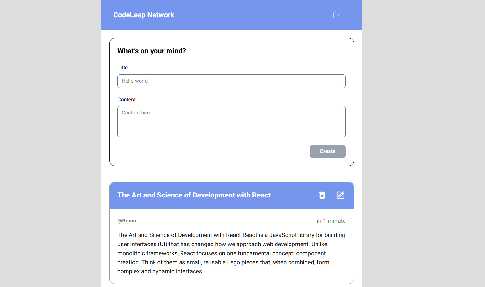

<h1 align="center"> CodeLeap Network </h1>
A modern web application built with Next.js, React, and TypeScript that simulates a social network where users can create, view, edit, and delete text posts.

 

  <a href="#-Technologies">Technologies</a>&nbsp;&nbsp;&nbsp;|&nbsp;&nbsp;&nbsp;
  <a href="#-Features">Features</a>&nbsp;&nbsp;&nbsp;|&nbsp;&nbsp;&nbsp;
  <a href="#-Design System">Design System</a>&nbsp;&nbsp;&nbsp

 

  

## 🚀 Technologies
- Next.js - React framework with App Router

- React - UI library

- TypeScript - Typed JavaScript

- Tailwind CSS - Utility-first CSS framework

- date-fns - Date utility library

- HTML5 & CSS3 - Markup and styling

## 📋 Features
- Authentication
Simple username-based signup

- Session persistence via localStorage

- Automatic redirect on logout

- Posts
Create posts with title and content

- List posts ordered by date (newest first)

- Edit posts (only own posts)

- Delete posts (only own posts)

- Automatic list updates after operations

- Interface
Responsive design for mobile and desktop

- Confirmation modals for critical actions

- Loading states with skeleton screens

- Visual feedback for user actions

## 🎨 Design System
- Colors
Primary: #7695EC

- Background: #DDDDDD

- Text: #000000

- Danger: #FF5151

- Success: #47B960

- Typography
Main Font: Roboto

- Sizes: Scalable system with rem and em units

- Components
Buttons with variants (primary, danger, success, outline)

- Reusable modals

- Styled inputs and textareas

- Post cards

## ⚙️ Setup and Installation
- Prerequisites
Node.js 18+

- npm or yarn

- Execution Steps
Clone the repository:

- bash
git clone <repository-url>
cd frontend-codeleap
Install dependencies:

- bash
npm install
Run the development server:

- bash
npm run dev
Open http://localhost:3000 in your browser

## 🔧 Key Components
- useUser Hook
Manages user state and persists to localStorage.

- usePosts Hook
Handles CRUD operations for posts and API communication.

- Button Component
Reusable component with multiple variants and states.

- Modal Components
Modal system for action confirmations and content editing.

## Project

To access the project, click [HERE](https://codeleap-frontend-eta.vercel.app/)

## 📄 License
This project is licensed under the MIT License. See the LICENSE file for details.

## 👥 Contribution
Fork the project

Create a feature branch (git checkout -b feature/AmazingFeature)

Commit your changes (git commit -m 'Add some AmazingFeature')

Push to the branch (git push origin feature/AmazingFeature)

Open a Pull Request

## 📞 Contact
For questions or suggestions, please contact through the project repository.

Built with ❤️ using Next.js and React